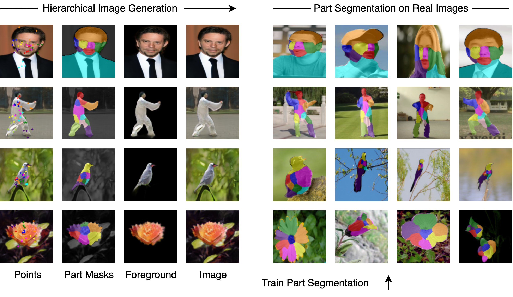

# GANSeg: Learning to Segment by Unsupervised Hierarchical Image Generation (CVPR 2022)

>**GANSeg: Learning to Segment by Unsupervised Hierarchical Image Generation**
>[Xingzhe He](https://xingzhehe.github.io/), [Bastian Wandt](http://bastianwandt.de/), and [Helge Rhodin](http://helge.rhodin.de/)
>*IEEE/CVF Conference on Computer Vision and Pattern Recognition **CVPR 2022***

[[Paper](https://arxiv.org/abs/2112.01036)]

## Setup

### Setup environment
```
conda create -n ganseg python=3.8
conda activate ganseg
pip install -r requirements.txt
```
### Download datasets

The [CelebA-in-the-wild](https://mmlab.ie.cuhk.edu.hk/projects/CelebA.html), [Taichi](https://github.com/AliaksandrSiarohin/motion-cosegmentation), [CUB](http://www.vision.caltech.edu/visipedia/CUB-200-2011.html) and [Flower](https://www.robots.ox.ac.uk/~vgg/data/flowers/102/index.html) can be found on their websites. We provide the pre-processing code for CelebA-in-the-wild, CUB and Flower to make them `h5` files. Taichi can be used directly.

### Download pre-trained models

The pre-trained models (GAN and Segmenter) can be downloaded from [Google Drive](https://drive.google.com/drive/folders/1u-yKGETL8Z3HMnignKLikiC9VXRYXiXq?usp=sharing).

## Testing

### Segmentation

You can use `gen_mask.py` to generate the segmentation masks.
```
python gen_mask.py --segmenter_log log/seg_celeba_wild_k8 --test_class_name mafl_wild_test --data_root data/celeba_wild --save_root saved_mask/celeba_wild_k8 --checkpoint 10
```
where, 
- `--log` specifies the log folder of the segmentation network,
- `--test_class_name` specifices the particular dataset to test, 
- `--data_root` specifies the location of the dataset (the folder containing the `h5` file), 
- `--save_root` defines the location of the saved images, and
- `--checkpoint` specifies the index of the checkpoint.

Therefore, the above command will generate masks on the CelebA-in-the-wild.
	
You can also quantitatively test the segmentation.

```
python test_seg.py --segmenter_log log/seg_celeba_wild_k8 --test_class_name mafl_wild_test --data_root data/celeba_wild --checkpoint 10
```
### GAN

You can use `gen_img.py` to generate images with our GAN.

```
python gen_img.py --generator_log log/gan_celeba_wild_k8 --save_root saved_image/celeba_wild_k8 --checkpoint 30
```

## Training

### GAN

To train our GAN on CelebA-in-the-wild, run
```
python train_gan.py --class_name celeba_wild --data_root data/celeba_wild --n_keypoints 8
```
The trained weights and log can be found in ```logs/gan_celeba_wild_k8```.

We also provide a `custom` choice for `class_name`. You can specify `data_root` to your own image folder to train our GAN on your own images.

To finetune the learned model, run
```
python train_gan.py --class_name celeba_wild --data_root data/celeba_wild --n_keypoints 8 --checkpoint [the epoch index to start]
```
The example parameters can be found in `log`. 

### Segmentation

To train the segmenter on the pre-trained GAN (CelebA-in-the-wild), run

```
python train_seg.py --generator_log log/gan_celeba_wild_k8 --data_root data/celeba_wild --checkpoint 30
```

where, 

- `--generator_log` specifies the generator log folder (used to generate image-mask pairs),
- `--data_root` specifies the location of the dataset, and
- `--checkpoint` specifies the index of the checkpoint of the GAN.

## Citation

```
@article{he2021ganseg,
  title={GANSeg: Learning to Segment by Unsupervised Hierarchical Image Generation},
  author={He, Xingzhe and Wandt, Bastian and Rhodin, Helge},
  journal={arXiv preprint arXiv:2112.01036},
  year={2021}
}
```
## Acknowledgements
The code is built upon [LatentKeypointGAN](https://xingzhehe.github.io/LatentKeypointGAN/).